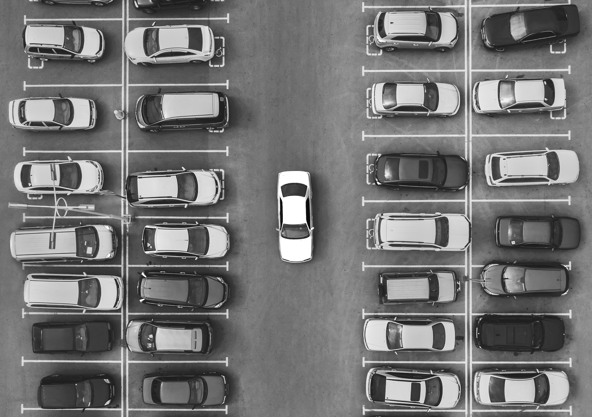
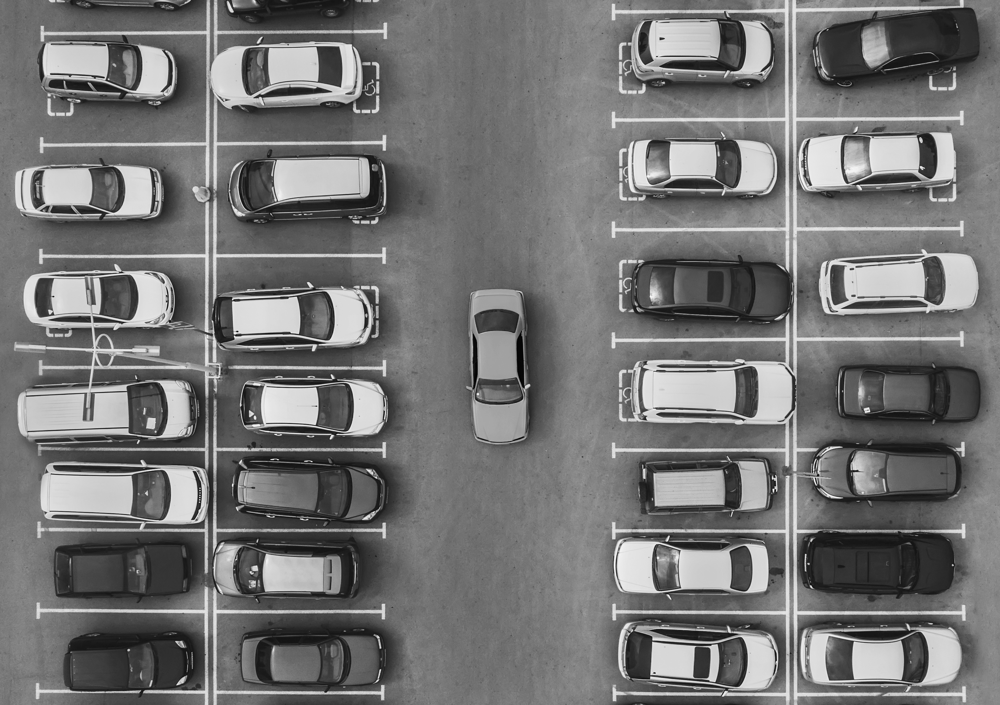
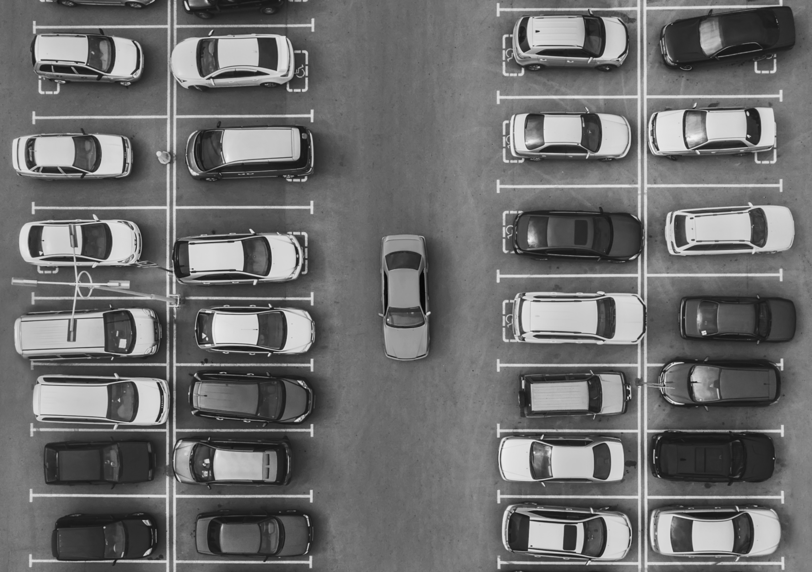
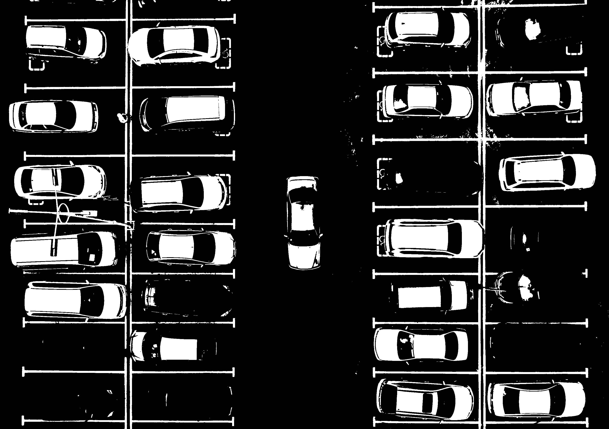
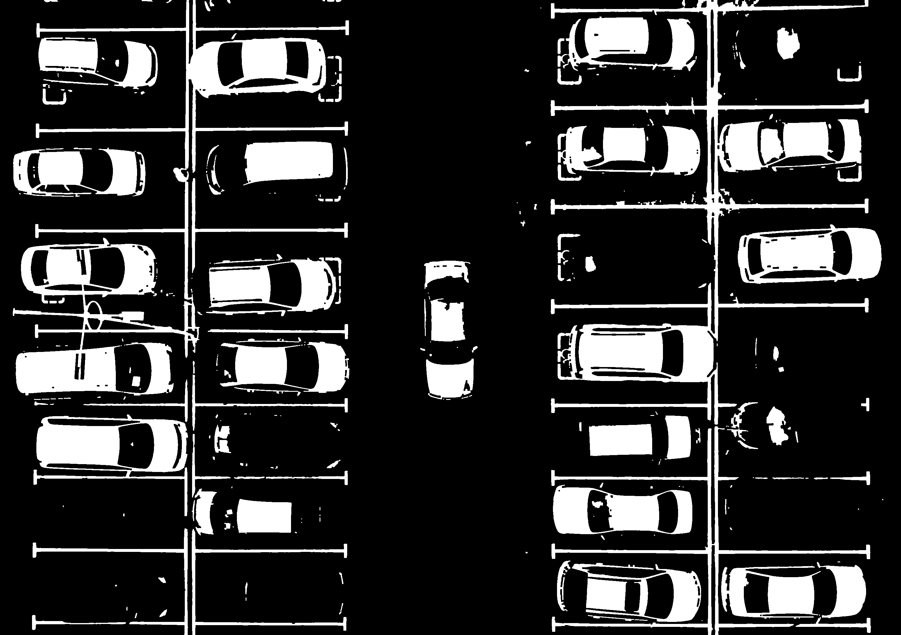
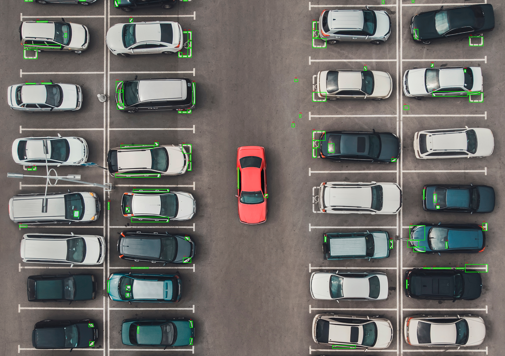

# Mini Project 2 — Object Counting: Deteksi dan Penghitungan Mobil pada Citra Area Parkiran

**Mata Kuliah:** Pengolahan Citra dan Video <br>
**Nama:** Athaya Khairani Adi  <br>
**NRP:** 5024241007  

---

## Jumlah Mobil Terdeteksi

Program mendeteksi **29 mobil** pada citra input `parking_ori.jpg`.

> Angka ini didapat setelah menyaring semua objek berdasarkan ukurannya (filtering kontur) — hanya objek dengan luas antara 3000 hingga 50000 piksel yang dihitung sebagai mobil.
---

## Penjelasan Pipeline

Pipeline yang digunakan adalah pendekatan **threshold-based** yang dikombinasikan dengan operasi morfologi. Secara garis besar, program ini bekerja dengan cara mengubah foto berwarna menjadi hitam-putih, lalu membersihkan hasilnya, dan terakhir menghitung objek yang bentuk dan ukurannya menyerupai mobil.

```
Citra Asli (BGR)
      |
      v
[Tahap 1] Konversi Color Space  -->  Grayscale / HSV-V / LAB-L
      |
      v  (dipilih: Grayscale)
[Tahap 2] Gaussian Blur (kernel 5x5) -->  haluskan foto, kurangi noise
      |
      v
[Tahap 3] Otsu Thresholding  -->  ubah jadi hitam-putih otomatis
      |
      v
[Tahap 4a] Morphological Closing (kernel 3x3, 2 iterasi)
      |
      v
[Tahap 4b] Morphological Opening (kernel 3x3, 1 iterasi)
      |
      v
[Tahap 5] findContours + Filter Area  -->  Bounding Box + Penghitungan
```

---

## Visualisasi dan Analisis Tahapan Pipeline

### Tahap 0: Citra Asli

| | |
|---|---|
| **Gambar** |  |
| **Format** | BGR (Blue-Green-Red), 3 channel warna |
| **Kondisi** | Foto area parkiran dengan pencahayaan alami |
| **Karakteristik** | Terdapat kendaraan, aspal, marka jalan, dan bayangan |

---

### Tahap 1: Pilih Format Warna yang Paling Jelas

Citra asli dikonversi ke tiga ruang warna, lalu memilih mana yang paling jelas membedakan mobil dari aspal.

| Aspek | Grayscale | HSV — Channel V | LAB — Channel L |
|-------|-----------|-----------------|-----------------|
| **Gambar** |  |  |  
| **Cara kerjanya** | Foto diubah jadi abu-abu berdasarkan terang-gelapnya tiap piksel | Diambil hanya info kecerahan dari ruang warna HSV | Diambil hanya info kecerahan dari ruang warna LAB, lebih sesuai cara mata manusia melihat |
| **Kelebihan** | Simpel, ringan, kontras mobil-aspal cukup terlihat | Kendaraan terang tampak lebih menonjol dari latar | Hasil lebih konsisten karena mengikuti persepsi visual manusia |
| **Kekurangan** | Mobil warna gelap susah dibedakan dari aspal | Mobil gelap tetap menyatu dengan latar | Prosesnya lebih berat, dan hasilnya tidak terlalu berbeda dari grayscale biasa |

**Keputusan:** Channel **Grayscale** dipilih untuk tahap selanjutnya karena hasilnya cukup bagus untuk membedakan mobil dari aspal, dan prosesnya paling ringan dibanding dua format lainnya.

---

### Tahap 2: Gaussian Blur

```python
blur = cv2.GaussianBlur(gray, (5, 5), 0)
```

Setelah foto diubah ke grayscale, foto dihaluskan dulu sebelum diproses lebih lanjut.
| Aspek | Sebelum (Grayscale) | Sesudah (Gaussian Blur) |
|---|---|---|
| **Gambar** |  |  |
| **Yang berubah** | Foto terlihat tajam tapi penuh bintik-bintik kecil dari tekstur aspal | Foto terlihat lebih halus, transisi antar area lebih lembut |
| **Noise** | Banyak bintik kecil terlihat di permukaan aspal | Bintik-bintik kecil berkurang |
| **Tepi mobil** | Tajam tapi berisik | Sedikit lebih lunak, lebih bersih |

**Cara kerja:** Gaussian Blur mengonvolusi citra dengan kernel Gaussian 5x5. Setiap piksel baru merupakan rata-rata tertimbang dari piksel-piksel di sekitarnya, di mana piksel terdekat mendapat bobot paling tinggi. Operasi ini menekan komponen frekuensi tinggi seperti noise dan detail tekstur kecil yang tidak relevan bagi deteksi kendaraan.

**Mengapa perlu di-blur dulu?** Kalau langsung diproses tanpa dihaluskan, bintik-bintik kecil di aspal bisa ikut terbaca sebagai objek dan akhirnya salah dihitung sebagai mobil. Proses blur ini ibarat "menyaring" detail yang tidak penting sebelum lanjut ke tahap berikutnya.

---

### Tahap 3: Otsu Thresholding  — Ubah Jadi Hitam-Putih

```python
ret, thresh = cv2.threshold(blur, 0, 255, cv2.THRESH_BINARY + cv2.THRESH_OTSU)
```

| Aspek | Sebelum Thresholding (Blur) | Sesudah Otsu Thresholding |
|-------|-----------------------------|--------------------------|
| **Gambar** |  |  |
| **Representasi** | Grayscale (0-255) | Biner: 0 (hitam) atau 255 (putih) |
| **Piksel putih** | Tidak ada | Area dengan intensitas di atas nilai threshold Otsu |
| **Piksel hitam** | Tidak ada | Area aspal dan latar gelap |
| **Nilai threshold** | Tidak berlaku | Dihitung otomatis oleh algoritma Otsu |

**Cara kerja Otsu:** Algoritma Otsu mencari nilai threshold T yang paling tepat untuk memisahkan dua kelompok piksel (terang dan gelap), yaitu latar belakang (intensitas < T) dan objek (intensitas >= T). Nilai T optimal adalah titik yang paling jelas memisahkan dua puncak distribusi pada histogram citra.

**Keunggulan dibanding threshold manual:** Tidak memerlukan penentuan nilai threshold secara manual sehingga lebih adaptif terhadap variasi pencahayaan pada citra aerial.

**Catatan:** Mobil berwarna gelap kadang tidak tertangkap di sini karena kecerahan warnanya terlalu mirip dengan aspal.

---

### Tahap 4a: Morphological Closing

Setelah diubah jadi hitam-putih, bentuk mobil sering terlihat berlubang karena bagian kaca atau atap warnanya berbeda. Tahap ini menutup lubang-lubang tersebut.

```python
kernel = np.ones((3, 3), np.uint8)
morph_close = cv2.morphologyEx(thresh, cv2.MORPH_CLOSE, kernel, iterations=2)
```

| Aspek | Sebelum (Thresholding) | Sesudah (Closing) |
|---|---|---|
| **Gambar** |  |  |
| **Yang berubah** | Bentuk mobil terlihat berlubang dan tidak utuh | Bentuk mobil menjadi lebih solid dan penuh |
| **Lubang di dalam objek** | Banyak, terutama di area kaca dan atap | Sebagian besar tertutup |
| **Ukuran objek** | Kecil dan tidak utuh | Sedikit lebih besar karena proses pengisian |
| **Batas tepi** | Tidak rata dan berlubang | Lebih halus dan penuh |

**Cara kerja:** Closing merupakan Dilasi diikuti Erosi. Dilasi terlebih dahulu memperluas area putih sehingga celah kecil tertutup. Erosi kemudian mengecilkan kembali area ke ukuran semula, tetapi celah yang sudah tertutup tidak terbuka lagi.

Proses ini dilakukan **2 kali** karena satu kali saja tidak cukup untuk menutup semua celah, terutama yang agak lebar seperti area kaca depan mobil.

---

### Tahap 4b: Morphological Opening — Bersihkan Bintik Noise

Setelah closing, masih ada bintik-bintik putih kecil yang tersisa di area aspal dan bukan bagian dari mobil. Tahap ini membersihkannya.
```python
morph_clean = cv2.morphologyEx(morph_close, cv2.MORPH_OPEN, kernel, iterations=1)
```

| Aspek | Sebelum (Closing) | Sesudah (Opening) |
|---|---|---|
| **Gambar** |  |  |
| **Yang berubah** | Masih ada bintik putih kecil di area aspal | Bintik-bintik kecil hilang |
| **Bentuk mobil** | Utuh dan solid | Tetap utuh, tidak ikut terhapus |
| **Kebersihan gambar** | Cukup bersih | Lebih bersih, siap untuk penghitungan |

**Cara kerja:** Opening merupakan Erosi diikuti Dilasi. Erosi menghapus piksel putih pada tepi semua objek, bintik-bintik kecil yang dimensinya lebih kecil dari kernel langsung hilang sepenuhnya. Dilasi kemudian mengembalikan ukuran objek besar yang tersisa, tetapi bintik kecil yang sudah terhapus tidak muncul kembali.

**Mengapa closing dulu baru opening?** Kalau urutannya dibalik, lubang di dalam mobil yang baru saja ditutup akan terbuka lagi. Jadi closing harus selalu dilakukan lebih dulu.

---

### Perbandingan Seluruh Tahap Morfologi

| | Otsu Threshold | Setelah Closing | Setelah Opening |
|---|---|---|---|
| **Gambar** |  |  |  |
| **Kondisi bentuk mobil** | Berlubang, tidak utuh | Solid, sedikit membesar | Solid, bersih dari noise |
| **Celah di dalam objek** | Banyak | Tertutup | Tertutup |
| **Bintik noise di aspal** | Ada | Masih ada | Dihilangkan |
| **Kesiapan untuk kontur** | Belum siap | Cukup siap | Siap |

---

### Tahap 5: Deteksi Kontur dan Perhitungan Mobil

Program mencari semua bentuk (kontur) yang ada di gambar, lalu menyaring mana yang kemungkinan besar adalah mobil berdasarkan ukurannya.

```python
contours, _ = cv2.findContours(morph_clean, cv2.RETR_EXTERNAL, cv2.CHAIN_APPROX_SIMPLE)
```

| Aspek | Keterangan |
|-------|-----------|
| **Mode deteksi** | `RETR_EXTERNAL`: hanya mendeteksi kontur paling luar, kontur di dalam objek diabaikan |
| **Metode aproksimasi** | `CHAIN_APPROX_SIMPLE`: mengompresi segmen menjadi titik ujungnya saja untuk efisiensi memori |
| **Filter MIN_AREA** | 300 piksel: Bentuk yang terlalu kecil dari ini dianggap noise, bukan mobil |
| **Filter MAX_AREA** | 50000 piksel: Bentuk yang terlalu besar dari ini dianggap bukan satu mobil (mungkin dua mobil yang menyatu atau objek lain) |
| **Bounding box** | Kotak hijau digambar pada tiap kendaraan yang lolos filter |
| **Label** | Nomor urut berwarna merah ditulis di atas tiap bounding box |

| Aspek | Sesudah Opening (Input Kontur) | Hasil Akhir Deteksi |
|-------|-------------------------------|---------------------|
| **Gambar** |  |  |
| **Representasi** | Citra biner, warna putih = kandidat kendaraan | Citra asli dengan bounding box hijau dan nomor merah |
| **Jumlah objek** | Seluruh bentuk termasuk noise sisa | Hanya bentuk yang memenuhi rentang area 3000-50000 piksel |

---

## Analisis

### Kendala yang Dihadapi

| No. | Kendala | Dampak pada Hasil | Penyebabnya |
|-----|---------|-------------------|-------------|
| 1 | Mobil yang parkir berdekatan menyatu jadi satu bentuk | Dua atau lebih mobil terhitung sebagai satu | Jarak antarmobil terlalu kecil sehingga bentuknya bergabung setelah diproses |
| 2 | Mobil berwarna gelap (hitam, abu tua) tidak terdeteksi | Mobil tersebut tidak muncul di hasil dan tidak terhitung | Warna gelapnya terlalu mirip dengan aspal sehingga ikut "hilang" saat thresholding |
| 3 | Batas ukuran (3000-50000 piksel) tidak fleksibel | Kalau foto diambil dari ketinggian berbeda, batas ini perlu diubah manual | Nilai batas tidak disesuaikan secara otomatis dengan ukuran foto |

### Potensi Peningkatan

| No. | Teknik | Manfaatnya |
|-----|--------|-----------|
| 1 | Watershed Algorithm (`cv2.watershed`) | Bisa memisahkan mobil-mobil yang menyatu agar masing-masing terhitung terpisah |
| 2 | Distance Transform | Membantu memisahkan objek yang saling menempel sebelum dihitung |
| 3 | Batas ukuran otomatis | Batas 3000-50000 piksel disesuaikan otomatis dengan resolusi foto agar tidak perlu diubah manual |
---

## Cara Menjalankan Program

### Prasyarat

Pastikan Python sudah terpasang. Instal seluruh dependensi menggunakan perintah berikut:

```bash
pip install opencv-python numpy matplotlib
```

### Struktur Direktori

Pastikan struktur folder berada dalam kondisi berikut sebelum menjalankan program:

```
MP2-Object-Counting/
├── README.md
├── counting.py
├── input/
│   └── parking_ori.jpg
└── output/
    ├── result.png
    └── steps/
        ├── 1_color_space_gray.png
        ├── 1_color_space_hsv_v.png
        ├── 1_color_space_lab_l.png
        ├── 2_gaussian_blur.png
        ├── 3_otsu_threshold.png
        ├── 4_morphology_close.png
        └── 5_morphology_open_clean.png
```

### Menjalankan Program

Jalankan perintah berikut dari direktori utama proyek:

```bash
python counting.py
```

Program akan mencetak jumlah kendaraan yang terdeteksi ke terminal dan menyimpan seluruh file output secara otomatis. Selain itu, dua jendela visualisasi matplotlib akan ditampilkan secara langsung: satu untuk perbandingan format warna di Tahap 1 dan satu untuk alur kerja pipeline lengkap dari citra asli hingga hasil deteksi akhir.
